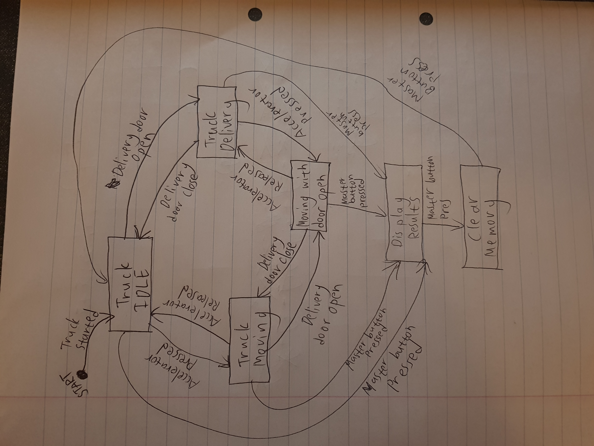

# Data Logger (and using cool sensors!)

*A lab report by Frans Fourie. Student.*

## In The Report

Include your responses to the bold questions on your own fork of [this lab report template](https://github.com/FAR-Lab/IDD-Fa18-Lab2). Include snippets of code that explain what you did. Deliverables are due next Tuesday. Post your lab reports as README.md pages on your GitHub, and post a link to that on your main class hub page.

For this lab, we will be experimenting with a variety of sensors, sending the data to the Arduino serial monitor, writing data to the EEPROM of the Arduino, and then playing the data back.

## Part A.  Writing to the Serial Monitor
 
**a. Based on the readings from the serial monitor, what is the range of the analog values being read?**

0 - 1023
 
**b. How many bits of resolution does the analog to digital converter (ADC) on the Arduino have?**

10 bits

## Part B. RGB LED

I used the FSR to control the color of the RGB LED by varying the color depending on how hard you press the FSR.

The following is a link to the youtube video:
https://youtu.be/oulqR6I8oBw

The following is the code used:
```
int redPin = 11;
int greenPin = 10;
int bluePin = 9;
 
//uncomment this line if using a Common Anode LED
//#define COMMON_ANODE

int redC = 0;
int redG = 0;
int redB = 0;
int fsrAnalogPin = 0; // FSR is connected to analog 0
int fsrReading;      // the analog reading from the FSR resistor divider
int LEDbrightness;
 
void setup()
{
  Serial.begin(9600);
  pinMode(redPin, OUTPUT);
  pinMode(greenPin, OUTPUT);
  pinMode(bluePin, OUTPUT);  
}
 
void loop()
{
  fsrReading = analogRead(fsrAnalogPin);
  Serial.print("Analog reading = ");
  Serial.println(fsrReading);
  LEDbrightness = map(fsrReading, 0, 1023, 0, 765);
  if (LEDbrightness <= 255){
    setColor(LEDbrightness, 0, 0);
  }
  if ((LEDbrightness > 255) || (LEDbrightness <= 510)){
    redC = 510 - LEDbrightness;
    redG = LEDbrightness - 255;
    setColor(redC, redG, 0);
  }
  if ((LEDbrightness > 510) || (LEDbrightness <= 765)){
    redG = 765 - LEDbrightness;
    redB = LEDbrightness - 510;
    setColor(0, redG, redB);
  }

}
 
void setColor(int red, int green, int blue)
{
  #ifdef COMMON_ANODE
    red = red - 255;
    green = green - 255;
    blue = blue - 255;
  #endif
  analogWrite(redPin, red);
  analogWrite(greenPin, green);
  analogWrite(bluePin, blue);  
}
```

## Part C. Voltage Varying Sensors 
 
### 1. FSR, Flex Sensor, Photo cell, Softpot

**a. What voltage values do you see from your force sensor?**

I got between 0 - 1002 which correlates to 0V - 4.89736V

**b. What kind of relationship does the voltage have as a function of the force applied? (e.g., linear?)**

It's an almost linear relationship except at low force values where a small amount of force reduces the resistance greatly. As resistance decreases the voltage will increase. Thus, there is a linear relationship between force and voltage as, as the force increases so does the voltage.

The following is the graph of resistance vs force of the FSR


**c. Can you change the LED fading code values so that you get the full range of output voltages from the LED when using your FSR?**

Changing the line of code ```LEDbrightness = map(fsrReading, 0, 1023, 0, 255);``` to ```LEDbrightness = map(fsrReading, 0, 1000, 0, 255);``` this will allow for all 256 values of the LED intensity to be reached. By mapping the achievable values to the range 0 - 255 we can achieve the full range of values.

**d. What resistance do you need to have in series to get a reasonable range of voltages from each sensor?**

For the softpot resistor I put a 10k ohm resistor in series between power and the one side leg pin of the resistor and I also put a 10k ohm resistor between ground and the other side leg of the softpot resistor. I did this as it was what was recommended by the datasheet. With this I got voltages between 1.8V - 3.2V.

For the photocell I put a 10k ohm resistor parallel with the analog input pin and the one leg of the photocell. The other leg of the photocell was connected to 5V. With the lights off I got voltages as low as 0.0879V and by shinning a torch on the resistor I got voltage readings as high as 4.8387V.

The Flex sensor is like the FSR and thus we will also make use of a 10k ohm resistor in series.


**e. What kind of relationship does the resistance have as a function of stimulus? (e.g., linear?)**

For the Flex sensor it is linear with the bent angle and for softpot it is linear with the touch position. The photocell has a Logarithmic relationship between the illumination and the resistance.

### 2. Accelerometer
 
**a. Include your accelerometer read-out code in your write-up.**

The following is a Video of my accelerometer working:
https://youtu.be/DFjhx0JTU-8

The following is my code for the accelerometer with the RGB light and the LCD display:
```
// Basic demo for accelerometer readings from Adafruit LIS3DH
#include <LiquidCrystal.h>

#include <Wire.h>
#include <SPI.h>
#include <Adafruit_LIS3DH.h>
#include <Adafruit_Sensor.h>

// Used for software SPI
#define LIS3DH_CLK 13
#define LIS3DH_MISO 12
#define LIS3DH_MOSI 11
// Used for hardware & software SPI
#define LIS3DH_CS 10

// software SPI
//Adafruit_LIS3DH lis = Adafruit_LIS3DH(LIS3DH_CS, LIS3DH_MOSI, LIS3DH_MISO, LIS3DH_CLK);
// hardware SPI
//Adafruit_LIS3DH lis = Adafruit_LIS3DH(LIS3DH_CS);
// I2C
Adafruit_LIS3DH lis = Adafruit_LIS3DH();

const int rs = 12, en = 11, d4 = 5, d5 = 4, d6 = 3, d7 = 2;
LiquidCrystal lcd(rs, en, d4, d5, d6, d7);

int redPin = 6;
int greenPin = 10;
int bluePin = 9;
int LEDbrightness;

void setup(void) {
#ifndef ESP8266
  while (!Serial);     // will pause Zero, Leonardo, etc until serial console opens
#endif

  Serial.begin(9600);
  Serial.println("LIS3DH test!");
  lcd.begin(16, 2);
  pinMode(redPin, OUTPUT);
  pinMode(greenPin, OUTPUT);
  pinMode(bluePin, OUTPUT); 
  
  if (! lis.begin(0x18)) {   // change this to 0x19 for alternative i2c address
    Serial.println("Couldnt start");
    while (1);
  }
  Serial.println("LIS3DH found!");
  
  lis.setRange(LIS3DH_RANGE_4_G);   // 2, 4, 8 or 16 G!
  
  Serial.print("Range = "); Serial.print(2 << lis.getRange());  
  Serial.println("G");
}

void loop() {
  lis.read();      // get X Y and Z data at once
  // Then print out the raw data
  Serial.print("X:  "); Serial.print(lis.x); 
  Serial.print("  \tY:  "); Serial.print(lis.y); 
  Serial.print("  \tZ:  "); Serial.print(lis.z); 

  /* Or....get a new sensor event, normalized */ 
  sensors_event_t event; 
  lis.getEvent(&event);
  
  /* Display the results (acceleration is measured in m/s^2) */
  lcd.setCursor(0, 0);
  lcd.print("x=" + String(event.acceleration.x));
  lcd.setCursor(8, 0);
  lcd.print("y=" + String(event.acceleration.y));
  lcd.setCursor(0, 2);
  lcd.print("z=" + String(event.acceleration.z));
  lcd.setCursor(7, 2);
  lcd.print("m/s^2");  
  Serial.print("\t\tX: "); Serial.print(event.acceleration.x);
  Serial.print(" \tY: "); Serial.print(event.acceleration.y); 
  Serial.print(" \tZ: "); Serial.print(event.acceleration.z); 
  Serial.println(" m/s^2 ");
  setColor(event.acceleration.x, event.acceleration.y, event.acceleration.z);

  Serial.println();
 
  delay(200); 
}


void setColor(int red, int green, int blue)
{
  #ifdef COMMON_ANODE
    red = 255 - red;
    green = 255 - green;
    blue = 255 - blue;
  #endif
  analogWrite(redPin, red);
  analogWrite(greenPin, green);
  analogWrite(bluePin, blue);  
}
```

## Optional. Graphic Display

**Take a picture of your screen working insert it here!**

## Part D. Logging values to the EEPROM and reading them back
 
### 1. Reading and writing values to the Arduino EEPROM

**a. Does it matter what actions are assigned to which state? Why?**

Yes, the clear state needs to be on one of the sides with the reading and writing states next to each other. If the clear state was in the middle it would be impossible to read a value from EEPROM after storing it considering that it would be cleared first if you tried going from the write to rad state.

**b. Why is the code here all in the setup() functions and not in the loop() functions?**

Because whenever we change the state, we only want the state’s main code to execute once and not repeatedly while the device remains in that state. For example, when entering the reading state, we only want to read the data stored once the same with the write state we only want to save once when we enter the state.

**c. How many byte-sized data samples can you store on the Atmega328?**

The Atmega328P has 1024 bytes of EEPROM memory and thus you will be able to save up to 1024 byte-sized data samples on it.

**d. How would you get analog data from the Arduino analog pins to be byte-sized? How about analog data from the I2C devices?**

For analog pins we get 10-bit data that needs to be converted to 8-bit data so that it can be saved in the EEPROM. We can accomplish this by mapping the 10-bit value 0-1023 to an 8-bit value 0-255. The new 8-bit value might not be precisely as accurate as the 10-bit value as some information is lost but it is the best possible way. The 8-bit value can later be recovered from memory and inflated to a number between 0-1023 again and will be within a few numbers of the correct original number. The other way is break up the 10-bit number and save it as 4, 8-bit values that can be summed together to create the original 10-bit number.

For I2C we do not have the format of the data we will receive. Because of the varying possible formats of data, we will receive each case will have to be evaluated individually. Then it will have to be decided if the received data can be saved as is or need to be converted to 8-bit data using the map function or if the received value will have to be stored across multiple 8-bit values.

**e. Alternately, how would we store the data if it were bigger than a byte? (hint: take a look at the [EEPROMPut](https://www.arduino.cc/en/Reference/EEPROMPut) example)**

By breaking the data up into byte sized data. For example, an int could be 2 or 4 bytes with long int being 8 bytes. Since we know this it is possible to break up an int into 2 or 4 bytes these can then be accurately stored in the EEPROM in 2 or 4 memory addresses.

**Upload your modified code that takes in analog values from your sensors and prints them back out to the Arduino Serial Monitor.**

### 2. Design your logger
 
**a. Insert here a copy of your final state diagram.**

The following is a picture of my completed state diagram


### 3. Create your data logger!

**a. Record and upload a short demo video of your logger in action.**

The following is a link to a video of my data logger working:
https://youtu.be/fjFXIrcaC1w

My data logger is a data logger for delivery trucks. The logger has 5 states and operates as a finite state machine meaning it is always in one of these states. The first is an idle state this is when the truck is started but not moving from this you could go to either the moving state which means the truck is moving or to the delivery door open state which means the back door of the truck is open and deliveries is being made. From one of these states it is also possible to enter a hazardous state which is when the truck is moving, and the delivery door is open. The final state is the state in which the manager can recall and look at the logged data as well as clear the data. The program starts if the truck is started loading the respective times from the EEPROM memory. The program then adds the time spent in each state as the truck is running the program saves the new times to the EEPROM every time there is a state change. When the truck gets back to the depo the manager can recall the data seeing how long the driver was busy with what and if there was a large amount of unaccounted for idle time or if there was time that the truck was in the hazardous state. The manager can then clear the datalogger in preparation for the next trip of the truck.

The following is my code:
```
#include <EEPROM.h>

#define BTND_PIN 2
#define BTNA_PIN 3
#define BTNM_PIN 4

#define LEDD_PIN 11
#define LEDA_PIN 12

int State = 0;

long int TimeChange = 0;
long int CurrentTime = 0;


long int Times[] = {0, 0, 0, 0};
int temp = 0;


void setup() {
  pinMode(BTND_PIN, INPUT);
  pinMode(BTNA_PIN, INPUT);
  pinMode(BTNM_PIN, INPUT);
  pinMode(LEDD_PIN, OUTPUT);
  pinMode(LEDA_PIN, OUTPUT);
  Serial.begin(9600);
  Times[0] = EEPROM_readlong(0);
  Times[1] = EEPROM_readlong(9);
  Times[2] = EEPROM_readlong(18);
  Times[3] = EEPROM_readlong(27);

}

// Generic function to check if a button is pressed
int buttonPressed(uint8_t button) {
  static uint16_t lastStates = 0;
  uint8_t state = digitalRead(button);
  if (state != ((lastStates >> button) & 1)) {
    lastStates ^= 1 << button;
    return state == HIGH;
  }
  return false;
}

void EEPROM_writelong(int address, unsigned long value)
{
 //truncate upper part and write lower part into EEPROM
 EEPROM_writeint(address+2, word(value));
 //shift upper part down
 value = value >> 16;
 //truncate and write
 EEPROM_writeint(address, word(value));
}

void EEPROM_writeint(int address, int value)
{
 EEPROM.write(address,highByte(value));
 EEPROM.write(address+1 ,lowByte(value));
}

unsigned int EEPROM_readint(int address)
{
 unsigned int word = word(EEPROM.read(address), EEPROM.read(address+1));
 return word;
}

unsigned long EEPROM_readlong(int address){
 //use word read function for reading upper part
 unsigned long dword = EEPROM_readint(address);
 //shift read word up
 dword = dword << 16;
 // read lower word from EEPROM and OR it into double word
 dword = dword | EEPROM_readint(address+2);
 return dword;
 }


void loop() {
  while(State == 0){
    digitalWrite(LEDD_PIN, LOW);
    digitalWrite(LEDA_PIN, LOW);
    if(buttonPressed(BTND_PIN)) {
      State = 1;
      TimeChange = abs((0.001 * (millis() - CurrentTime)));
      Times[0] = Times[0] + TimeChange;
      CurrentTime = millis();
      EEPROM_writelong(0, Times[0]);
    }
    if(buttonPressed(BTNA_PIN)) {
      State = 2;
      TimeChange = abs((0.001 * (millis() - CurrentTime)));
      Times[0] = Times[0] + TimeChange;
      CurrentTime = millis();
      EEPROM_writelong(0, Times[0]);
    }
    if(buttonPressed(BTNM_PIN)){
      State = 4;
      TimeChange = abs((0.001 * (millis() - CurrentTime)));
      Times[0] = Times[0] + TimeChange;
      CurrentTime = millis();
      EEPROM_writelong(0, Times[0]);
    }       
  }

  
  while(State == 1){
    digitalWrite(LEDD_PIN, HIGH);
    digitalWrite(LEDA_PIN, LOW);
    if(buttonPressed(BTND_PIN)) {
      State = 0;
      TimeChange = abs((0.001 * (millis() - CurrentTime)));
      Times[0] = Times[0] + TimeChange;
      Times[1] = Times[1] + TimeChange;
      CurrentTime = millis();
      EEPROM_writelong(0, Times[0]);
      EEPROM_writelong(9, Times[1]);
    }
    if(buttonPressed(BTNA_PIN)) {
      State = 3;
      TimeChange = abs((0.001 * (millis() - CurrentTime)));
      Times[0] = Times[0] + TimeChange;
      Times[1] = Times[1] + TimeChange;
      CurrentTime = millis();
      EEPROM_writelong(0, Times[0]);
      EEPROM_writelong(9, Times[1]);
    }
    if(buttonPressed(BTNM_PIN)){
      State = 4;
      TimeChange = abs((0.001 * (millis() - CurrentTime)));
      Times[0] = Times[0] + TimeChange;
      Times[1] = Times[1] + TimeChange;
      CurrentTime = millis();
      EEPROM_writelong(0, Times[0]);
      EEPROM_writelong(9, Times[1]);
    }           
  }
  
  while(State == 2){
    digitalWrite(LEDA_PIN, HIGH);
    digitalWrite(LEDD_PIN, LOW);
    if(buttonPressed(BTND_PIN)) {
      State = 3;
      TimeChange = abs((0.001 * (millis() - CurrentTime)));
      Times[0] = Times[0] + TimeChange;
      Times[2] = Times[2] + TimeChange;
      CurrentTime = millis();
      EEPROM_writelong(0, Times[0]);
      EEPROM_writelong(18, Times[2]);
    }
    if(buttonPressed(BTNA_PIN)) {
      State = 0;
      TimeChange = abs((0.001 * (millis() - CurrentTime)));
      Times[0] = Times[0] + TimeChange;
      Times[2] = Times[2] + TimeChange;
      CurrentTime = millis();
      EEPROM_writelong(0, Times[0]);
      EEPROM_writelong(18, Times[2]);
    }
    if(buttonPressed(BTNM_PIN)){
      State = 4;
      TimeChange = abs((0.001 * (millis() - CurrentTime)));
      Times[0] = Times[0] + TimeChange;
      Times[2] = Times[2] + TimeChange;
      CurrentTime = millis();
      EEPROM_writelong(0, Times[0]);
      EEPROM_writelong(18, Times[2]);
    }
  }
    
  while(State == 3){
    digitalWrite(LEDA_PIN, HIGH);
    digitalWrite(LEDD_PIN, HIGH);
    if(buttonPressed(BTND_PIN)) {
      State = 2;
      TimeChange = abs((0.001 * (millis() - CurrentTime)));
      Times[0] = Times[0] + TimeChange;
      Times[3] = Times[3] + TimeChange;
      CurrentTime = millis();
      EEPROM_writelong(0, Times[0]);
      EEPROM_writelong(27, Times[3]);
    }
    if(buttonPressed(BTNA_PIN)) {
      State = 1;
      TimeChange = abs((0.001 * (millis() - CurrentTime)));
      Times[0] = Times[0] + TimeChange;
      Times[3] = Times[3] + TimeChange;
      CurrentTime = millis();
      EEPROM_writelong(0, Times[0]);
      EEPROM_writelong(27, Times[3]);
    }
    if(buttonPressed(BTNM_PIN)){
      State = 4;
      TimeChange = abs((0.001 * (millis() - CurrentTime)));
      Times[0] = Times[0] + TimeChange;
      Times[3] = Times[3] + TimeChange;
      CurrentTime = millis();
      EEPROM_writelong(0, Times[0]);
      EEPROM_writelong(27, Times[3]);
    }
  }
  
  while(State == 4) {
    if (temp ==0){
      temp = 1;    
      digitalWrite(LEDD_PIN, LOW);
      digitalWrite(LEDA_PIN, LOW);
      Serial.println("Total truck run time: " + String(Times[0]));
      Serial.println("Total truck time moving: " + String(Times[1]));
      Serial.println("Total truck time with door open: " + String(Times[2]));
      Serial.println("Total truck time in hazard state: " + String(Times[3]));      
    }
    if(buttonPressed(BTNM_PIN)) {
      Serial.println("Memory Reset");
      State = 0; 
      for (int i = 0 ; i < 36 ; i++) {
        EEPROM.write(i, 0);
      }
      Times[0] = EEPROM_readlong(0);
      Times[1] = EEPROM_readlong(9);
      Times[2] = EEPROM_readlong(18);
      Times[3] = EEPROM_readlong(27);
      temp = 0;
    } 

    }
}
```
 

