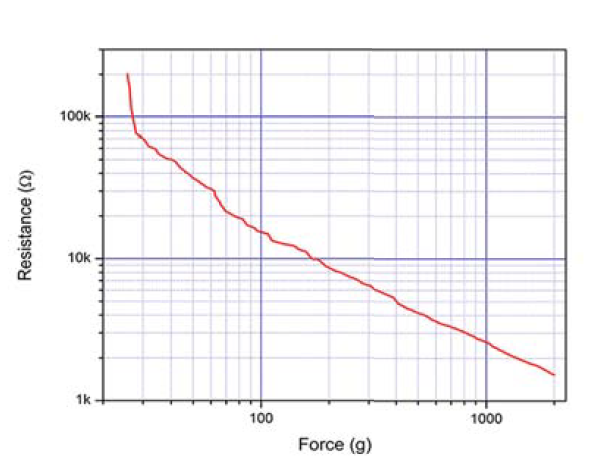

# Data Logger (and using cool sensors!)

*A lab report by John Q. Student.*

## In The Report

Include your responses to the bold questions on your own fork of [this lab report template](https://github.com/FAR-Lab/IDD-Fa18-Lab2). Include snippets of code that explain what you did. Deliverables are due next Tuesday. Post your lab reports as README.md pages on your GitHub, and post a link to that on your main class hub page.

For this lab, we will be experimenting with a variety of sensors, sending the data to the Arduino serial monitor, writing data to the EEPROM of the Arduino, and then playing the data back.

## Part A.  Writing to the Serial Monitor
 
**a. Based on the readings from the serial monitor, what is the range of the analog values being read?**

0 - 1023
 
**b. How many bits of resolution does the analog to digital converter (ADC) on the Arduino have?**

10 bits

## Part B. RGB LED

I used the FSR to control the color of the RGB LED by varying the color depending on how hard you press the FSR.

The following is a link to the youtube video:
https://youtu.be/oulqR6I8oBw

The following is the code used:
```
int redPin = 11;
int greenPin = 10;
int bluePin = 9;
 
//uncomment this line if using a Common Anode LED
//#define COMMON_ANODE

int redC = 0;
int redG = 0;
int redB = 0;
int fsrAnalogPin = 0; // FSR is connected to analog 0
int fsrReading;      // the analog reading from the FSR resistor divider
int LEDbrightness;
 
void setup()
{
  Serial.begin(9600);
  pinMode(redPin, OUTPUT);
  pinMode(greenPin, OUTPUT);
  pinMode(bluePin, OUTPUT);  
}
 
void loop()
{
  fsrReading = analogRead(fsrAnalogPin);
  Serial.print("Analog reading = ");
  Serial.println(fsrReading);
  LEDbrightness = map(fsrReading, 0, 1023, 0, 765);
  if (LEDbrightness <= 255){
    setColor(LEDbrightness, 0, 0);
  }
  if ((LEDbrightness > 255) || (LEDbrightness <= 510)){
    redC = 510 - LEDbrightness;
    redG = LEDbrightness - 255;
    setColor(redC, redG, 0);
  }
  if ((LEDbrightness > 510) || (LEDbrightness <= 765)){
    redG = 765 - LEDbrightness;
    redB = LEDbrightness - 510;
    setColor(0, redG, redB);
  }

}
 
void setColor(int red, int green, int blue)
{
  #ifdef COMMON_ANODE
    red = red - 255;
    green = green - 255;
    blue = blue - 255;
  #endif
  analogWrite(redPin, red);
  analogWrite(greenPin, green);
  analogWrite(bluePin, blue);  
}
```


## Part C. Voltage Varying Sensors 
 
### 1. FSR, Flex Sensor, Photo cell, Softpot

**a. What voltage values do you see from your force sensor?**

I got between 0 - 1002 which correlates to 0V - 4.89736V

**b. What kind of relationship does the voltage have as a function of the force applied? (e.g., linear?)**

It's an almot linear relationship except at low force values where a small amount of force reduces the resistance greatly. As resistance decreases the voltage will increase.

The following is the graph of resistance vs force of the FSR



**c. Can you change the LED fading code values so that you get the full range of output voltages from the LED when using your FSR?**

**d. What resistance do you need to have in series to get a reasonable range of voltages from each sensor?**

**e. What kind of relationship does the resistance have as a function of stimulus? (e.g., linear?)**

### 2. Accelerometer
 
**a. Include your accelerometer read-out code in your write-up.**

### 3. IR Proximity Sensor

**a. Describe the voltage change over the sensing range of the sensor. A sketch of voltage vs. distance would work also. Does it match up with what you expect from the datasheet?**

**b. Upload your merged code to your lab report repository and link to it here.**

## Optional. Graphic Display

**Take a picture of your screen working insert it here!**

## Part D. Logging values to the EEPROM and reading them back
 
### 1. Reading and writing values to the Arduino EEPROM

**a. Does it matter what actions are assigned to which state? Why?**

**b. Why is the code here all in the setup() functions and not in the loop() functions?**

**c. How many byte-sized data samples can you store on the Atmega328?**

**d. How would you get analog data from the Arduino analog pins to be byte-sized? How about analog data from the I2C devices?**

**e. Alternately, how would we store the data if it were bigger than a byte? (hint: take a look at the [EEPROMPut](https://www.arduino.cc/en/Reference/EEPROMPut) example)**

**Upload your modified code that takes in analog values from your sensors and prints them back out to the Arduino Serial Monitor.**

### 2. Design your logger
 
**a. Insert here a copy of your final state diagram.**

### 3. Create your data logger!
 
**a. Record and upload a short demo video of your logger in action.**
